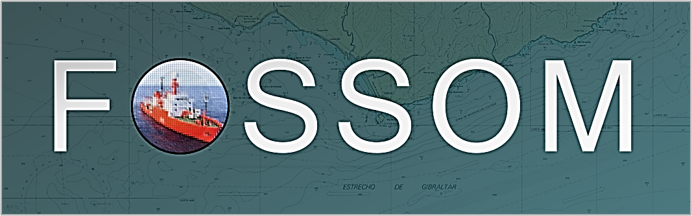

### Free and Open Source Software for Ocean Mapping (FOSSOM)

{: .center-image }

The hydrospatial community has advanced the use of Free and Open-Source Software (FOSS) in the ocean mapping workflow by developing new solutions and adopting tools originally developed for other applications. These specialized tools allow users to conduct common tasks in hydrography without the need for commercial software, but, most importantly, to perform tasks for which no proprietary solutions exist. Besides the above tools, there is a plethora of additional FOSS for geospatial applications (FOSS4G) that could be used in ocean mapping. Some form of documentation on the aforementioned tools exists. However, a comprehensive study of their capabilities and performance in ocean mapping is not yet available. It is not surprising that the use of FOSS4G within hydrographic offices remains limited. To fill this gap, this project, conducted by CDR Jose Cordero (IHM) and Dr Christos Kastrisios (CCOM/UNH), aims to investigate the functionalities of the available FOSS4G and raise awareness about the potential benefits of their use in the domain.

https://www.researchgate.net/project/Free-and-open-source-tools-for-ocean-mapping

#### The use case of the Spanish Exclusive Economic Zone ####

***

