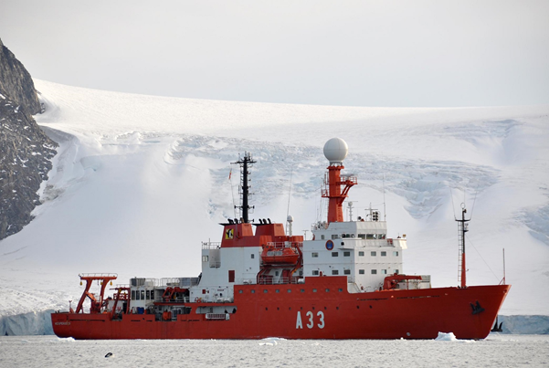
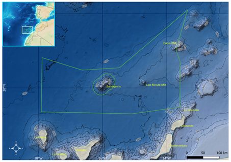

## The case of the Spanish Exclusive Economic Zone mapping survey 2021 

Introduction

The ZEEE project, standing for Spanish Exclusive Economic Zone in Spanish language, started in 1995 as the most intensive effort to map and explore the Spanish seafloor. The main objectives are to obtain an improved multibeam bathymetric cartography of the areas off Spanish coastlines and to perform a comprehensive geophysical survey including gravity geomagnetism and low-penetration seismic techniques. The data acquisition is carried out one month a year aboard RV “Hesperides” (Spanish Navy/CSIC). This ship is equipped with an MBES Kongsberg EM122, which is the most used system for deepwater mapping. The ZEEE working group consists of personnel from the Hydrographic Institute of the Spanish Navy (IHM), Spanish Oceanographic Institute (IEO),  Naval Observatory (ROA), Geological and Mining Institute of Spain, University Complutense of Madrid (UCM), and other research centers.

More information about RV Hesperides can be found here: http://www.utm.csic.es/en/instalaciones/hes

{: .center-image }

The ZEEE-2021 cruise took place from March 27th to April 24th . The study area had a surface of 70,500 km2 , comprising seafloors more than 4000 m deep in the north of the Canary Islands (Spain),  and including submarine features such as the Last Minute and Dacia seamounts

{: .center-image }

