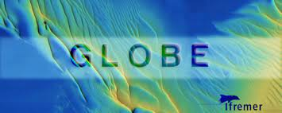

## GLOBE, an open source solution for multibeam data processing and visualization

{: .center-image }

GLOBE (GLobal Oceanographic Bathymetry Explorer) is a desktop software for for processing and displaying multibeam, seismic and other geospatial data

GLOBE provides a wide array of processing modules for bathymetric data, including:

    - Interactive point cloud data cleaning (subset editor)
    - Multibeam time series visualization
    - Correction for tides
    - Water column detections visualization
    - Generating digital elevation models.
    - Vector and raster data manipulation

Currently Kongsberg (.all and kmall) as well as Reson (s7K) format can be imported into GLOBE

It is developed in Java by Poncelet Cyrille, Billant Gael, Corre Marie-Paule at IFREMER (France) and free available under a LGPLv3 licence

GLOBE is currently being deployed on all IFREMER ships and also used by the European project EMODnet Hydrography for manipulating and creating digital elevation models.

More information and download links [here](https://www.flotteoceanographique.fr/en/Facilities/Shipboard-software/Analyse-et-traitement-de-l-information/GLOBE) 

***

