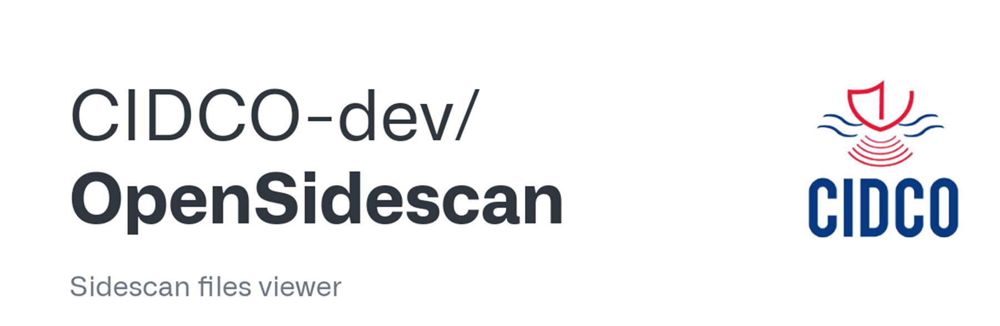

## OpenSideScan, an open source sidescan sonar data processing software

{: .center-image }

OpenSideScan is a data processing software to visualize and manipulate sidescan sonar imagery files, investigate seabed features or underwater infrastructures and create underwater inventories.

OpensideScan can read XTF files, measure real dimensions from seabed objects, and automatically detect targets by an unsupervised extraction of regions of interest. Resulting images and maps can be exported to JPG/PNG and KML formats, respectively.

It is developed by CIDCO (Centre Interdisciplinaire de Développement en Cartographie des Océans), a Canadian non-profit research center specialized in marine geomatics.

OpenSide scan is free and open source, with community support on GitHub, but also is  commercialized in custom versions with extra features and commercial support.

More information and download links [here](https://opensidescan.cidco.ca/) 

***

